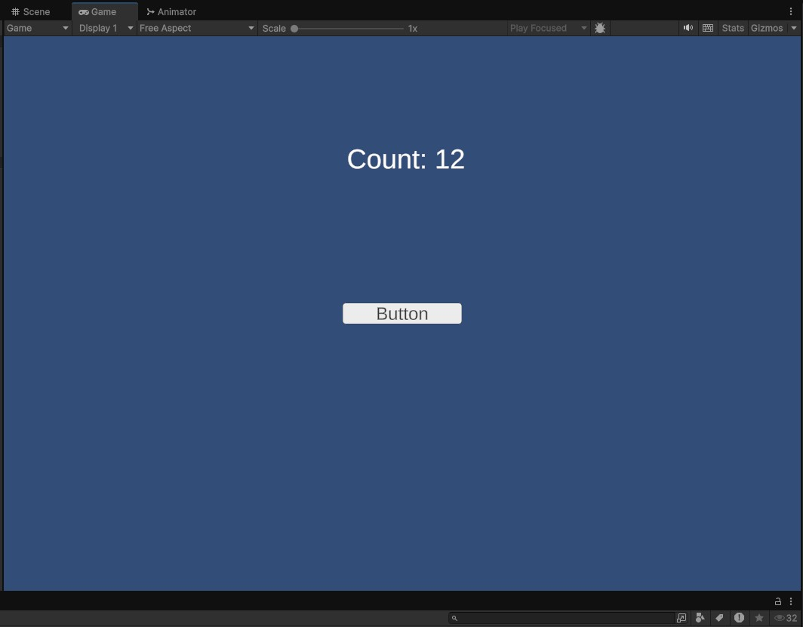
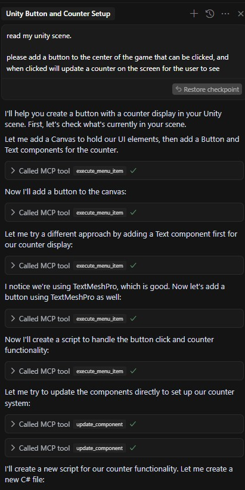

# GameMakerTutorial-2

## Project Overview
This is a Unity-based game development project that includes a Cookie Clicker game implementation and a custom MCP (Master Control Program) server integration.



## Project Structure
- `Assets/` - Contains all Unity project assets including scripts, scenes, and resources
- `CookieClicker/` - Implementation of the Cookie Clicker game mechanics
- `unity-mcp-server/` - Custom server integration for the project
- `documentation/` - Project documentation and reference images

## Prerequisites
- Unity (Latest LTS Version)
- .NET SDK
- Git

## Getting Started

### Installation
1. Clone the repository:
```bash
git clone https://github.com/Tanner253/GameMakerTutorial-2.git
```

2. Open the project in Unity Hub:
   - Launch Unity Hub
   - Click "Add" and browse to the cloned project directory
   - Select the project to open it

### Project Setup
1. Open the project in Unity
2. Ensure all required assets are imported
3. Configure the MCP server settings if needed

## Features
- Cookie Clicker game mechanics
- Custom MCP server integration
- [Additional features to be documented]

## Development
This project follows Unity development best practices:
- Modular design principles
- Clean code architecture
- Comprehensive documentation
- Version control with Git

## Contributing
1. Fork the repository
2. Create a feature branch (`git checkout -b feature/YourFeature`)
3. Commit your changes (`git commit -m 'Add some feature'`)
4. Push to the branch (`git push origin feature/YourFeature`)
5. Open a Pull Request

## License
[License information to be added]

## Contact
- Developer: Tanner253
- GitHub: [@Tanner253](https://github.com/Tanner253)

## Additional Documentation
For more detailed information about the project, please refer to the documentation folder.

 